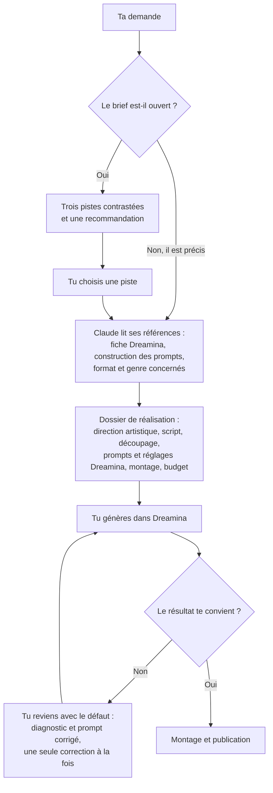
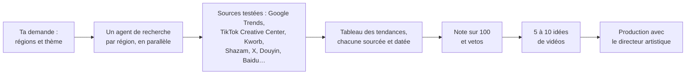

# Directeur artistique IA

**Deux skills Claude Code pour la vidéo générée par IA avec Seedance 2.5 sur Dreamina.**

- **`directeur-artistique`** transforme Claude en réalisateur : concept, script en français, découpage plan par plan, mouvements de caméra, lumière, direction d'acteur, son, et prompts Seedance prêts à coller dans Dreamina.
- **`veille-tendances`** repère ce qui émerge sur les réseaux, pays par pays, et le transforme en idées de vidéos réalisables en IA.

Ce sont uniquement des fichiers Markdown : aucun script, aucune dépendance, aucune clé d'API.

## Sommaire

- [Ce que font les skills](#ce-que-font-les-skills)
- [Comment ça fonctionne](#comment-ça-fonctionne)
- [Exemple](#exemple)
- [Installation](#installation)
- [Utilisation](#utilisation)
- [De l'idée à la vidéo publiée](#de-lidée-à-la-vidéo-publiée)
- [Structure du dépôt](#structure-du-dépôt)
- [Comment elles ont été construites](#comment-elles-ont-été-construites)
- [Tests](#tests)
- [Mise à jour](#mise-à-jour)
- [Limites connues](#limites-connues)
- [Crédits et licence](#crédits-et-licence)

## Ce que font les skills

### `directeur-artistique`

Tu décris une idée de vidéo ; la skill te rend un **dossier de réalisation** :

- **trois pistes créatives contrastées** quand le brief est ouvert, avec une recommandation argumentée ;
- **la direction artistique** : un préfixe de style à recopier dans chaque prompt, les fiches des personnages, les prompts de leurs images de référence, les décors, la politique sonore ;
- **le script en français** et **le découpage technique** plan par plan (valeur, mouvement, action, son, transition) ;
- **le plan de génération Dreamina** : pour chaque génération, le mode, les réglages (modèle, durée, format, résolution), l'ordre de chargement des références, et le prompt en anglais prêt à coller, résumé en une ligne en français ;
- **le montage**, le **budget en crédits** et les **risques** avec leur correction.

Elle couvre les clips musicaux, les courts-métrages, les mini-séries, le lifestyle, les formats tendance (TikTok, Reels, Shorts), les publicités, la promotion d'événements et les formats natifs de l'IA. Quand une génération rate, elle diagnostique le défaut et corrige le prompt, une chose à la fois.

Ce qu'elle sait, en résumé :
- **la plateforme** : modèles Seedance disponibles dans Dreamina, modes (y compris leurs noms dans l'interface française), limites, syntaxe des références `@Image 1`, crédits, restrictions ;
- **la construction des prompts** : ordre d'écriture, découpage seconde par seconde, densité d'action, négations, mots à éviter, modèles prêts à l'emploi ;
- **le métier** : langage caméra, lumière et étalonnage, direction d'acteur, son et dialogues, cohérence des personnages, effets visuels, structures par genre, écriture de scénario en français ;
- **le cadre** : étiquettes IA des plateformes, AI Act européen, droit français, droits musicaux.

### `veille-tendances`

- **Un agent de recherche par région**, lancés en parallèle, sur des sources testées une par une (Google Trends, TikTok Creative Center, Kworb, Shazam, tendances X, recherches chaudes de Douyin et Baidu…).
- **Chaque tendance est prouvée** par une source consultée et datée.
- **Une note sur 100** (pertinence, adéquation, stade du cycle de vie, faisabilité en IA, droits, différenciation) et des **vetos** automatiques.
- **Le repérage des décalages entre pays** : une tendance au pic ailleurs et absente dans ton pays, c'est l'occasion d'arriver avant tout le monde.
- **5 à 10 idées de vidéos** avec leur accroche, puis passage au directeur artistique pour la production.

## Comment ça fonctionne

### Ce qu'est une skill

Une skill est un dossier d'instructions que Claude Code charge quand ta demande correspond à ce qu'elle sait faire. Elle ne contient pas de code et n'appelle aucun service : elle change **la façon dont Claude travaille**, en lui donnant une méthode, des règles et des connaissances à jour.

Claude la charge en trois niveaux, pour rester rapide tout en ayant accès à une vingtaine de fichiers de savoir-faire :

| Niveau | Fichier | Quand Claude le lit |
|---|---|---|
| 1 | La **description**, dans l'en-tête de `SKILL.md` | Toujours. C'est elle qui déclenche la skill quand tu parles de vidéo, de clip, de script, de prompt ou de tendances |
| 2 | Le reste de **`SKILL.md`** | Dès que la skill se déclenche : le rôle, le déroulé, le gabarit du dossier, les règles de production |
| 3 | Les fichiers de **`references/`** | Seulement au besoin : la fiche Dreamina et la construction des prompts avant chaque production ; le reste selon le format demandé (clip, série…) ou le problème rencontré |

### Le déroulé du directeur artistique



- **Un brief ouvert** (« fais-moi une vidéo sur le café ») donne d'abord trois pistes très différentes, chacune avec son accroche, son rendu et son image phare. **Un brief précis** (format, durée et idée donnés) mène directement au dossier.
- **Avant d'écrire un prompt**, Claude relit la fiche technique de Dreamina (limites, modes, syntaxe des références) et les règles de construction des prompts. C'est ce qui évite les erreurs qu'on retrouve sans la skill, comme une limite de 15 s supposée pour Seedance 2.5.
- **Pour un gros projet** (série, court-métrage), Claude livre d'abord le socle : la bible des personnages, l'arc complet et le premier épisode entièrement produit. Il demande ta validation avant de produire la suite, pour qu'une erreur de direction se corrige avant d'avoir coûté des crédits sur tous les épisodes.
- **Quand une génération rate**, Claude détermine si le défaut est systématique (le prompt est en cause, il le réécrit) ou aléatoire (le prompt est bon, il faut d'autres prises), puis te redonne le prompt complet corrigé.

### Le déroulé de la veille



- **Chaque région est confiée à un agent qui travaille en parallèle des autres.** Une veille « tous les continents » ne prend donc pas plus de temps qu'une veille sur un seul pays.
- **Une tendance sans source consultée et datée n'est pas retenue** : une fausse tendance fait perdre des jours de production.
- **La note sur 100** pèse la pertinence, l'adéquation à ton objectif, le stade de la tendance (émergente, au pic, saturée), la faisabilité en IA, les droits et l'originalité. **Les vetos** écartent d'office ce qui touche à un drame, à la politique, à des mineurs, à une musique sans licence ou au visage d'une vraie personne.

### La mise à jour

Dis **« mets à jour la skill »**. Trois agents vérifient alors en parallèle les sources officielles, les nouveaux dépôts de prompts Seedance et les techniques récentes de la communauté. Claude compare leurs résultats avec la skill et te présente les corrections, ajouts et suppressions proposés, chacun avec sa source. **Il ne modifie rien sans ton accord.**

## Exemple

> fais moi un clip de 30 sec pour un son electro à 124 bpm, ambiance futuriste la nuit, je veux un vrai truc cinéma avec des mouvements de caméra de ouf, en vertical pour tiktok

La skill propose trois pistes et recommande « Suspendu » : une coureuse figée en plein saut entre deux tours pendant la montée musicale, la caméra qui tourne autour d'elle, et tout qui repart sur le drop. Elle livre ensuite le dossier : 16 mesures calées sur le tempo, un découpage en 10 plans, 7 générations Dreamina avec leurs réglages. Voici le plus court des prompts produits pour ce clip :

```
5 seconds, vertical 9:16 composition, one continuous shot.
@Image 1 is the first frame. It defines the opening composition: Vela frozen mid-leap over a 4 m gap between two towers, seen from behind and above.
Vela — black braid, orange windbreaker — stays frozen mid-leap while the camera pushes straight forward through thousands of suspended raindrops, already moving on the first frame, at a constant speed: from 8 m behind her to 3 m behind her over 5 seconds. The nearest droplets slide past the lens with deep parallax. End: medium-wide shot of her back, the far rooftop edge at 40% of the frame height. Hold.
BULLET TIME: time is frozen. Vela and every raindrop hang perfectly still in mid-air; the raindrops are thousands of motionless points of cyan light. Only the camera moves.
STYLE: photoreal live-action night footage, not a 3D render.
LIGHT: practical sources only: cyan-white LED strips along every floor of the towers, white maglev lights, small white aviation strobes on the rooftops. The sky is a flat black-blue haze. Blacks almost crushed; thin haze makes every beam visible.
PALETTE: ink blue-black and cold cyan-white; the only warm colour in frame is Vela's signal-orange windbreaker.
LENS: anamorphic look, oval bokeh, faint horizontal blue flares; 24 fps motion blur; subject in sharp focus.
SKIN: natural texture, visible pores, no retouching.
PHYSICS: gravity and inertia respected, real weight, correct contact shadows.
Audio includes only a low, muffled air rush that follows the camera. NO BGM. No subtitles. No text in frame.
```

On y retrouve les règles de la skill : la première image imposée, le personnage désigné par son nom et un repère visible (jamais par sa balise), un mouvement unique avec sa vitesse, ses distances de départ et d'arrivée, un état final tenu, puis le préfixe de style recopié à l'identique dans chaque prompt du projet.

Trois dossiers complets produits par la skill sont dans [`exemples/`](exemples/).

## Installation

Il faut [Claude Code](https://claude.com/claude-code) (terminal, application de bureau ou extension d'éditeur).

**1. Récupérer le dépôt**

```bash
git clone https://github.com/Izidine226/directeur-artistique-ia.git
```

**2. Copier les skills dans le dossier des skills de Claude Code**

macOS ou Linux :
```bash
mkdir -p ~/.claude/skills && cp -r directeur-artistique-ia/skills/* ~/.claude/skills/
```

Windows (PowerShell) :
```powershell
Copy-Item -Recurse directeur-artistique-ia\skills\* "$env:USERPROFILE\.claude\skills\"
```

**Variante : un lien plutôt qu'une copie**, pour qu'un `git pull` mette les skills à jour directement.

macOS ou Linux :
```bash
ln -s "$PWD/directeur-artistique-ia/skills/directeur-artistique" ~/.claude/skills/directeur-artistique
ln -s "$PWD/directeur-artistique-ia/skills/veille-tendances" ~/.claude/skills/veille-tendances
```

Windows (PowerShell, sans droits administrateur) :
```powershell
New-Item -ItemType Junction -Path "$env:USERPROFILE\.claude\skills\directeur-artistique" -Target "$PWD\directeur-artistique-ia\skills\directeur-artistique"
New-Item -ItemType Junction -Path "$env:USERPROFILE\.claude\skills\veille-tendances" -Target "$PWD\directeur-artistique-ia\skills\veille-tendances"
```

Pour réserver les skills à un seul projet, place-les dans le dossier `.claude/skills/` de ce projet.

Les skills sont disponibles à partir de la session suivante de Claude Code.

## Utilisation

**Automatiquement** : demande ce que tu veux, la bonne skill se déclenche.

> j'ai besoin d'une pub de 15 sec pour une marque de café, format reels

> lance moi une mini série de 4 épisodes d'1 minute, thriller dans un bar la nuit

> ma génération a des mains en trop et la caméra tourne dans tous les sens, voilà le prompt : …

> c'est quoi les tendances qui marchent en ce moment en Corée et au Brésil ? propose moi des idées

**Explicitement** : `/directeur-artistique` ou `/veille-tendances`.

**Pour un gros projet** (série, court-métrage), la skill livre d'abord le socle complet (bible des personnages, arc, premier épisode entièrement produit), puis demande validation avant de produire la suite.

## De l'idée à la vidéo publiée

1. **Demande ta vidéo** à Claude, avec ce que tu sais déjà : le format, la durée, la plateforme, l'ambiance, ta musique si tu en as une.
2. **Lis le dossier.** Commence par la direction artistique et le découpage : si le parti pris ne te plaît pas, dis-le maintenant, ça ne coûte rien.
3. **Prépare tes références dans Dreamina.** Génère les images de référence des personnages et des décors avec les prompts d'image fournis, puis enregistre chaque personnage récurrent comme **Élément**. Tu le cites ensuite avec `@` dans tous les prompts, et il garde le même visage d'un plan à l'autre.
4. **Pour chaque génération du plan de génération :**
   - choisis le **mode** indiqué (par exemple « Références de tout type ») ;
   - règle le **modèle, la durée, le format et la résolution** ;
   - charge les références **dans l'ordre indiqué**, avec le sélecteur `@` ;
   - colle le **prompt** tel quel.
5. **Commence en brouillon** avec « Seedance 2.5 (for preview) » en 480p, qui coûte moins cher, pour valider les plans, le placement et les personnages. Génère ensuite en qualité finale.
6. **Fais plusieurs prises des plans importants** et garde la meilleure. Une prise ratée contient parfois deux secondes parfaites à récupérer.
7. **Si un plan rate**, reviens vers Claude avec le prompt et ce qui ne va pas (« les mains se déforment », « la caméra part dans tous les sens »). Tu reçois le diagnostic et le prompt corrigé.
8. **Monte la vidéo** (CapCut ou autre) en suivant la partie « Montage et finitions » du dossier : ordre des plans, coupes calées sur la musique, texte à l'écran, sous-titres. Les textes, logos et prix s'ajoutent toujours au montage, jamais dans la génération.
9. **Avant de publier**, passe la liste de contrôle du dossier : étiquette IA de la plateforme, droits de la musique, mentions obligatoires si c'est du contenu commercial.

**Astuce** : comme les prompts sont en anglais, passe l'interface de Dreamina en anglais. Les balises de référence (`@Image 1`, `@Video 1`) correspondront alors exactement au texte des prompts.

## Structure du dépôt

```
directeur-artistique-ia/
├── skills/
│   ├── directeur-artistique/
│   │   ├── SKILL.md                    le rôle, le déroulé, le gabarit du dossier
│   │   ├── CHANGELOG.md
│   │   ├── CREDITS.md
│   │   └── references/
│   │       ├── dreamina-seedance.md    fiche technique de la plateforme (datée)
│   │       ├── prompt-craft.md         construction des prompts, modèles prêts à l'emploi
│   │       ├── camera-language.md      valeurs de plan, angles, mouvements, optiques
│   │       ├── light-color-look.md     lumière, palette, pellicules, éviter le rendu IA
│   │       ├── acting-direction.md     direction d'acteur, regard, émotions
│   │       ├── sound-music.md          son, dialogues, voix, synchronisation musicale
│   │       ├── continuity.md           cohérence des personnages et des décors
│   │       ├── motion-vfx.md           mouvement, physique, effets visuels
│   │       ├── genres.md               structures et exemples par genre
│   │       ├── script-writing-fr.md    scénario et découpage en français
│   │       ├── troubleshooting.md      symptôme, cause, correction
│   │       ├── legal-ethics.md         étiquettes IA, droit, musique
│   │       ├── self-update.md          procédure de mise à jour
│   │       └── formats/                clip, court-métrage, mini-série, lifestyle,
│   │                                   tendances et accroches, pub, événement, IA natif
│   └── veille-tendances/
│       ├── SKILL.md
│       └── references/
│           ├── sources.md              sources testées et méthode par marché
│           ├── regions.md              plateformes, formats, musiques par région
│           └── scoring.md              cycle de vie, note sur 100, vetos, fiche tendance
├── tests/
│   ├── evals.json                      les cas de test et leurs critères
│   └── resultats.md                    les résultats de la version 1.0
└── exemples/                           trois dossiers produits par la skill
```

## Comment elles ont été construites

La recherche a été menée le **1er octobre 2026** par quatre agents travaillant en parallèle :

1. **Les sources officielles** : l'interface de Dreamina en direct (consultée sans générer ni se connecter), la documentation BytePlus ModelArk et les annonces de ByteDance Seed. Chaque fait est sourcé et étiqueté : officiel, tiers ou estimation.
2. **Les dépôts communautaires** : une quinzaine de skills et de guides de prompts Seedance analysés.
3. **La skill communautaire la plus complète**, lue en détail.
4. **La vidéo courte** : accroches, rétention, formats, codes culturels de chaque région, méthode de veille, règles légales.

**Sécurité.** Une skill injecte des instructions dans le comportement de Claude. Les techniques ont donc été **reformulées** ; aucun texte n'a été recopié, et **aucun script, fichier de configuration ou instruction d'installation n'a été repris**. Plusieurs dépôts analysés contenaient des consignes destinées aux agents (pré-autorisation de commandes, installation d'outils, mentions promotionnelles) : elles ont été écartées.

## Tests

Trois demandes réelles ont été produites **avec et sans la skill**, puis notées par un correcteur indépendant sur 14 à 16 critères vérifiables (prompts en anglais prêts à coller, réglages à part, plages de temps contiguës, aucun âge dans les prompts, mouvements de caméra précis, livrables propres à chaque format…).

| Cas | Avec la skill | Sans la skill |
|---|---|---|
| Clip electro de 30 s à 124 BPM, vertical | 14/14 | 11/14 |
| Vidéo lifestyle de 20 s, « morning routine » | 14/14 | 12/14 |
| Mini-série thriller de 4 épisodes d'une minute | 15/16 | 11/16 |
| **Total** | **98 %** | **77 %** |

Seuls les dossiers produits **sans** la skill contenaient des erreurs sur Seedance : une limite de 15 s supposée pour la version 2.5, ou le doublage en français présenté comme fiable. Le détail est dans [`tests/resultats.md`](tests/resultats.md).

## Mise à jour

Seedance et Dreamina changent tous les mois. Dis simplement **« mets à jour la skill »** : des agents vérifient les sources officielles et les nouveaux dépôts, puis te présentent les changements proposés avec leurs sources. **Rien n'est modifié sans ton accord.**

La date de dernière vérification figure en tête de [`dreamina-seedance.md`](skills/directeur-artistique/references/dreamina-seedance.md). Au-delà de 60 jours, la skill le signale d'elle-même.

## Limites connues

- **Le français n'est pas une langue officielle de Seedance.** Les prompts sont en anglais. Pour des dialogues en français, il faut tester sur un plan court, ou générer sans voix puis utiliser la synchronisation labiale de Dreamina.
- **Les coûts en crédits sont des estimations** : Dreamina ne publie pas le coût d'une génération. Le coût réel s'affiche sur le bouton Générer.
- **Les tarifs, limites et règles datent du 1er octobre 2026.**
- **La version 1.0 produit des dossiers longs** (environ 8 000 mots), même pour une vidéo de 20 secondes. La prochaine version adaptera la longueur à l'ampleur du projet et proposera systématiquement une version économe en crédits.
- **Usage commercial** : les conditions de Dreamina sont floues sur ce point. Vérifie-les avant de publier une publicité.
- **Ce n'est pas un avis juridique.**

## Crédits et licence

Les sources officielles et les dépôts communautaires dont les techniques ont été reformulées sont listés, avec leurs licences, dans [`CREDITS.md`](skills/directeur-artistique/CREDITS.md).

Ce dépôt est publié sous licence [MIT](LICENSE).

Projet indépendant, sans lien avec ByteDance, CapCut, Dreamina, BytePlus ni Anthropic. Seedance et Dreamina sont des marques de leurs propriétaires respectifs.
